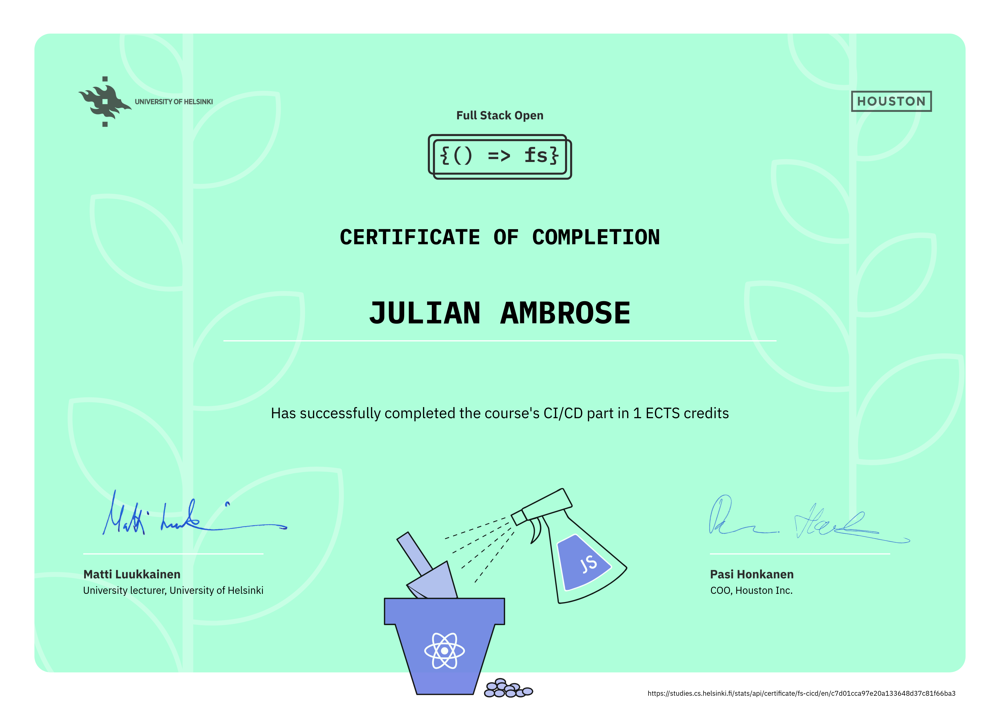

# Full Stack open CI/CD
This repository is used for the CI/CD module of the Full stack open course

Fork the repository to complete course exercises

## Commands
Start by running `npm install` inside the project folder

`npm start` to run the webpack dev server  
`npm test` to run tests  
`npm run eslint` to run eslint  
`npm run build` to make a production build  
`npm run start-prod` to run your production build  

## Course Information
A collection of exercises completed as part of Full Stack Open, part 11. The exercises cover setting up continuous integration and deployment workflows, automated testing, linting, production builds, and deploying the application.

Link to CI/CD part 5 repo: [full-stack-open-part5-cicd](https://github.com/jt-ambrose00/full-stack-open-part5-cicd)

## Course Completion Certificate
